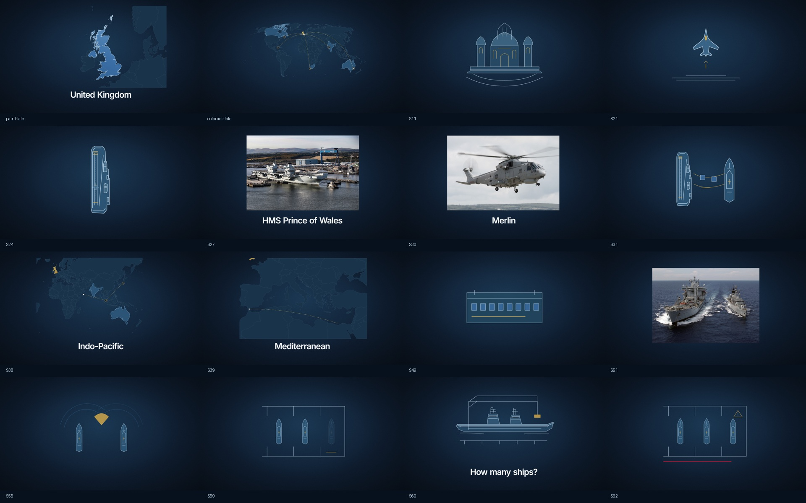

# Royal Navy — power at sea

Composição editável sincronizada ao áudio fornecido **Intro.mp3**.

**1920×1080 · 30 fps · 6047 frames · 3:21,567 · 62 cenas**

**Revisão 3:** mapas geográficos reais com **Turf.js**, pintura líquida do Reino Unido, rotas pontilhadas para antigas colônias e animação pela integração oficial **`@remotion/gsap`**, com uso efetivo de **`useGsapTimeline()`**. Todos os globos e as duas balanças foram substituídos na composição. O storyboard alterna 15 cenas cartográficas, ilustrações navais redesenhadas, tipografia, seis recortes gerados e cinco fotografias licenciadas.



## Prévia e exportação

```sh
npm ci
npm run dev
```

Abra a URL indicada pelo Studio e selecione **RoyalNavy**. A pasta **Scenes** contém planos independentes. A composição principal inclui a mixagem; os planos isolados são prévias visuais.

```sh
npm run render
```

Exporta `out/RoyalNavy.mp4`. O Remotion pode baixar o Chrome Headless Shell automaticamente. Também aceita Chrome instalado via `--browser-executable`.

## Entregáveis

| Conteúdo | Arquivo |
|---|---|
| Uma Sequence por cena | [src/Film.tsx](src/Film.tsx) |
| Componentes individuais | [src/scenes](src/scenes) |
| Layout Emotion e animação GSAP | [src/Scene.tsx](src/Scene.tsx) |
| Timeline em segundos e frames | [data/timeline.json](data/timeline.json) |
| Timeline tabular | [data/timeline.csv](data/timeline.csv) |
| 571 palavras com timestamps | [data/words.json](data/words.json) |
| Transcrição corrigida | [data/transcript.txt](data/transcript.txt) |
| Lista de SVGs | [ASSETS.md](ASSETS.md) |
| SVGs navais revisados | [public/svg-v3](public/svg-v3) |
| SVGs cartográficos | [public/maps](public/maps) |
| Dados geográficos e origem | [data/geography](data/geography) |
| Storyboard revisado | [STORYBOARD.md](STORYBOARD.md) |
| Narração original | [public/audio/Intro.mp3](public/audio/Intro.mp3) |
| Mixagem pronta | [public/audio/mix.mp3](public/audio/mix.mp3) |
| Música e efeitos originais | [public/audio](public/audio) |
| Gerador de assets e timeline | [scripts/build-design.mjs](scripts/build-design.mjs) |
| Síntese e mixagem de áudio | [scripts/audio.py](scripts/audio.py) |

## Direção e movimento

Paleta solicitada, Inter local, fundo em gradiente com grão discreto e vinheta. São 35 SVGs navais exportáveis e 16 vistas cartográficas disponíveis. Desenho por stroke-dashoffset e preenchimento posterior. Os navios são ilustrações editoriais; os mapas partem de dados geográficos Natural Earth, com detalhe 1:10 milhões para Reino Unido e Irlanda e 1:50 milhões para o mundo.

Turf.js processa limites, orienta e simplifica polígonos e calcula geodésicas, comprimentos e amostras dos trajetos. D3 faz a projeção para o SVG. Os arquivos são locais: a prévia não depende de uma API de mapas nem de chaves. A pintura líquida usa uma frente de tinta animada, com turbulência determinística e máscara recortada ao contorno do Reino Unido; a costa permanece precisa.

As conexões históricas ligam o Reino Unido a Canadá, Jamaica, África do Sul, Índia e Austrália. São exemplos de antigas colônias, com limites atuais; não é um mapa completo do império em uma data específica. As conexões modernas são esquemas geográficos e não reconstituem trajetos reais de navios.

Planos principais de 2–4 segundos, sem repetir asset principal, entrada ou saída em cenas consecutivas. Nas listas rápidas da narração, o mesmo plano troca seu único ícone ou nome na palavra correspondente. Esses handoffs internos são mais rápidos que a duração dos planos; nunca exibem painéis concorrentes.

`useGsapTimeline()` controla elementos DOM/SVG em [Scene.tsx](src/Scene.tsx), [MapAtlas.tsx](src/MapAtlas.tsx) e [NavalGraphic.tsx](src/NavalGraphic.tsx). O hook oficial gerencia a timeline pausada e busca o frame; não há ticker manual nem callbacks de animação. Entradas de 0,5 s usam power3.out/expo.out; saídas de 0,3 s usam power2.in. Os números são derivados do frame com easing GSAP e snap inteiro, conforme a restrição do hook a alvos DOM/SVG. Máscaras de palavras, pintura, desenho das rotas e micro-movimento são animados pelo hook.

Referências: [integração oficial Remotion/GSAP](https://www.remotion.dev/docs/gsap/use-gsap-timeline), [Turf greatCircle](https://turfjs.org/docs/api/greatCircle), [Natural Earth — domínio público](https://www.naturalearthdata.com/about/terms-of-use/).

Os oito PNGs gerados anteriormente permanecem disponíveis, com [prompts](data/image-prompts.json); o globo não é usado e o Merlin gerado fica como alternativa à fotografia. Fotografias e créditos em [IMAGE-SOURCES.md](IMAGE-SOURCES.md).

## Sincronização

A transcrição local existente, feita por faster-whisper small, foi reaproveitada após confirmar o SHA-256 idêntico ao MP3 solicitado:

`ace38ad49a5e4d7c71737578aeed2195d96a098ab04561d8d54d2a69a49d481c`

Os ícones principais começam quatro frames antes dos gatilhos alinhados. Textos usam timestamps das palavras correspondentes quando disponíveis. Nomes editoriais e a pergunta final usam a frase falada próxima. Corrigidas as grafias **Highmast** e **Númenor**; a transcrição bruta foi preservada.

Os timestamps de ASR são estimativas. O agendamento em frames foi verificado; a precisão acústica de ±3 frames para todas as palavras não foi certificada manualmente.

O vídeo segue a narração fornecida, incluindo sua referência à missão de 2025. O número 24 corresponde ao momento descrito no roteiro, não a uma afirmação nova sobre o máximo de aeronaves de toda a operação.

## Áudio

Voz normalizada para alvo -16 LUFS / -1,5 dBTP. Trilha original de pads em tom menor: fonte normalizada por pico e atenuada em 22 dB, seguida de ducking pela voz (5:1, ataque 25 ms, release 350 ms). Whooshes e hits suaves atenuados em 18 dB, com limitador final. Os valores em dB descrevem os ganhos aplicados, não níveis LUFS constantes.

Para refazer: Python com numpy e Pillow, FFmpeg no PATH, depois `python scripts/audio.py`. Os WAV intermediários são ignorados pelo Git. A mixagem MP3 entregue funciona sem Python.

## Validação

```sh
npm run check
npm run lint
```

Checagens de continuidade, duração, antecipação dos ícones, variação de assets/movimentos e cobertura do áudio. Revisão visual registrada em [QA.md](QA.md).

Para refazer a cartografia e os SVGs sem alterar o áudio:

```sh
node scripts/build-geography.mjs
node scripts/revise-storyboard.mjs
node scripts/export-vectors.mjs
```

`fetch-geography.mjs` atualiza os dados a partir do repositório Natural Earth; não é necessário para usar os dados congelados nesta entrega. A revisão completa de frames está em `scripts/review-stills.mjs` (ajuste `CHROME_PATH` se necessário).

## Repositórios públicos utilizados

- [Remotion](https://github.com/remotion-dev/remotion): composição e renderizador.
- [GSAP](https://github.com/greensock/GSAP): animação.
- [Emotion](https://github.com/emotion-js/emotion): componentes estilizados.
- [faster-whisper](https://github.com/SYSTRAN/faster-whisper): transcrição de origem.
- [Inter](https://github.com/rsms/inter): fonte local, licença OFL incluída.

Cada dependência conserva sua licença. A narração é o material fornecido pelo usuário.

Nomenclatura conferida no [anúncio da missão](https://www.royalnavy.mod.uk/news/2025/april/22/20250422-headline-deployment-of-2025-begins-as-thousands-wave-off-task-group-ships) e no [relato do retorno](https://www.royalnavy.mod.uk/news/2025/november/28/20251128-csg-homecoming) da Royal Navy.
