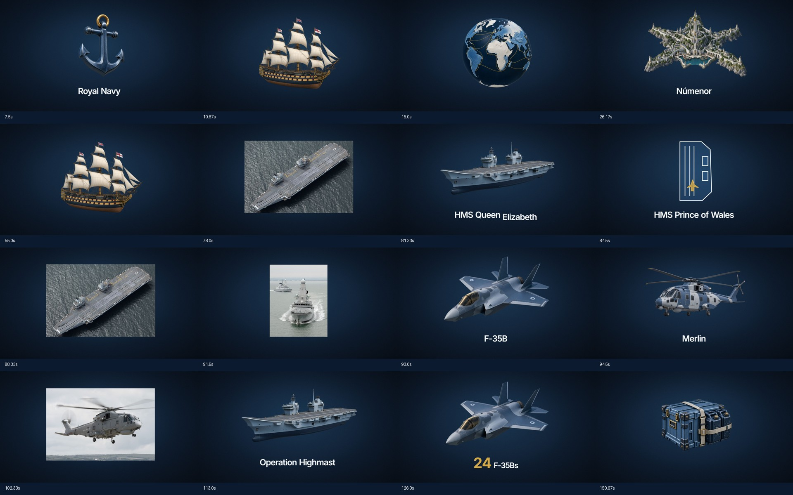

# Royal Navy — power at sea

Composição editável sincronizada ao áudio fornecido **Intro.mp3**.

**1920×1080 · 30 fps · 6047 frames · 3:21,567 · 62 cenas · 44 SVGs originais**

**Versão 2:** a composição combina os SVGs com **8 PNGs gerados com transparência** e **3 fotografias navais da internet**. Assets gerados e fotos documentais estão identificados em [IMAGE-SOURCES.md](IMAGE-SOURCES.md), com os [prompts completos](data/image-prompts.json). Os novos elementos já estão inseridos e animados na timeline.



## Prévia e exportação

```sh
npm ci
npm run dev
```

Abra a URL indicada pelo Studio e selecione **RoyalNavy**. A pasta **Scenes** contém planos independentes. A composição principal inclui a mixagem; os planos isolados são prévias visuais.

```sh
npm run render
```

Exporta `out/RoyalNavy.mp4`. O Remotion pode baixar o Chrome Headless Shell automaticamente. Também aceita Chrome instalado via `--browser-executable`.

## Entregáveis

| Conteúdo | Arquivo |
|---|---|
| Uma Sequence por cena | [src/Film.tsx](src/Film.tsx) |
| Componentes individuais | [src/scenes](src/scenes) |
| Layout Emotion e animação GSAP | [src/Scene.tsx](src/Scene.tsx) |
| Timeline em segundos e frames | [data/timeline.json](data/timeline.json) |
| Timeline tabular | [data/timeline.csv](data/timeline.csv) |
| 571 palavras com timestamps | [data/words.json](data/words.json) |
| Transcrição corrigida | [data/transcript.txt](data/transcript.txt) |
| Lista de SVGs | [ASSETS.md](ASSETS.md) |
| SVGs transparentes | [public/svg](public/svg) |
| Narração original | [public/audio/Intro.mp3](public/audio/Intro.mp3) |
| Mixagem pronta | [public/audio/mix.mp3](public/audio/mix.mp3) |
| Música e efeitos originais | [public/audio](public/audio) |
| Gerador de assets e timeline | [scripts/build-design.mjs](scripts/build-design.mjs) |
| Síntese e mixagem de áudio | [scripts/audio.py](scripts/audio.py) |

## Direção e movimento

Paleta solicitada, Inter local, fundo em gradiente com grão discreto e vinheta. SVGs originais com traço uniforme, desenho por stroke-dashoffset e preenchimento posterior. Mapas e equipamentos são ilustrações esquemáticas, não desenhos técnicos.

Planos principais de 2–4 segundos, sem repetir asset principal, entrada ou saída em cenas consecutivas. Nas listas rápidas da narração, o mesmo plano troca seu único ícone ou nome na palavra correspondente. Esses handoffs internos são mais rápidos que a duração dos planos; nunca exibem painéis concorrentes.

GSAP usa timelines pausadas, posicionadas explicitamente pelo frame do Remotion. Entradas: 0,5 s, power3.out ou expo.out. Saídas: 0,3 s, power2.in. Contadores usam snap inteiro. Zoom lento e deslocamento mantêm movimento contínuo. As transições usam direção de navegação, horizonte, mergulho, íris e passagem de página conforme o conceito.

## Sincronização

A transcrição local existente, feita por faster-whisper small, foi reaproveitada após confirmar o SHA-256 idêntico ao MP3 solicitado:

`ace38ad49a5e4d7c71737578aeed2195d96a098ab04561d8d54d2a69a49d481c`

Os ícones principais começam quatro frames antes dos gatilhos alinhados. Textos usam timestamps das palavras correspondentes quando disponíveis. Nomes editoriais e a pergunta final usam a frase falada próxima. Corrigidas as grafias **Highmast** e **Númenor**; a transcrição bruta foi preservada.

Os timestamps de ASR são estimativas. O agendamento em frames foi verificado; a precisão acústica de ±3 frames para todas as palavras não foi certificada manualmente.

O vídeo segue a narração fornecida, incluindo sua referência à missão de 2025. O número 24 corresponde ao momento descrito no roteiro, não a uma afirmação nova sobre o máximo de aeronaves de toda a operação.

## Áudio

Voz normalizada para alvo -16 LUFS / -1,5 dBTP. Trilha original de pads em tom menor: fonte normalizada por pico e atenuada em 22 dB, seguida de ducking pela voz (5:1, ataque 25 ms, release 350 ms). Whooshes e hits suaves atenuados em 18 dB, com limitador final. Os valores em dB descrevem os ganhos aplicados, não níveis LUFS constantes.

Para refazer: Python com numpy e Pillow, FFmpeg no PATH, depois `python scripts/audio.py`. Os WAV intermediários são ignorados pelo Git. A mixagem MP3 entregue funciona sem Python.

## Validação

```sh
npm run check
npm run lint
```

Checagens de continuidade, duração, antecipação dos ícones, variação de assets/movimentos e cobertura do áudio. Revisão visual registrada em [QA.md](QA.md).

## Repositórios públicos utilizados

- [Remotion](https://github.com/remotion-dev/remotion): composição e renderizador.
- [GSAP](https://github.com/greensock/GSAP): animação.
- [Emotion](https://github.com/emotion-js/emotion): componentes estilizados.
- [faster-whisper](https://github.com/SYSTRAN/faster-whisper): transcrição de origem.
- [Inter](https://github.com/rsms/inter): fonte local, licença OFL incluída.

Cada dependência conserva sua licença. A narração é o material fornecido pelo usuário.

Nomenclatura conferida no [anúncio da missão](https://www.royalnavy.mod.uk/news/2025/april/22/20250422-headline-deployment-of-2025-begins-as-thousands-wave-off-task-group-ships) e no [relato do retorno](https://www.royalnavy.mod.uk/news/2025/november/28/20251128-csg-homecoming) da Royal Navy.
