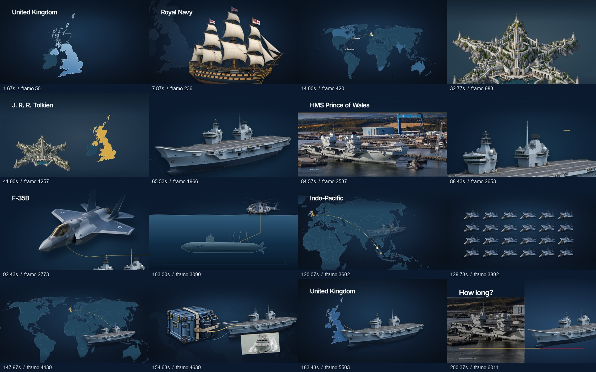

# Royal Navy — power at sea

Composição Remotion editável, sincronizada à narração **Intro.mp3**.

**1920×1080 · 30 fps · 6047 frames · 3:21,567**

A revisão 4 reorganiza o filme em **quatro ambientes contínuos**, com movimentos de câmera que ligam mapas, navios, fotografias e diagramas. Aproximações do convés, deslocamentos sobre os mapas, passagens de aeronaves e a travessia da linha d’água dão continuidade à ação. Fotografias documentais e recortes gerados ocupam o quadro; a montagem anterior de 35 ícones SVG foi retirada da composição ativa.

As **62 Sequences de marcação da narração** permanecem editáveis individualmente. Elas controlam os textos e os gatilhos das palavras, enquanto a imagem continua se movimentando entre as marcações. As três passagens entre capítulos têm sobreposição de 12 frames.



Trechos em movimento, cada um com 8 segundos, áudio e 240 frames em 960×540 a 30 fps:

- [Fotografia e aproximação do convés](docs/preview-carrier-v4.mp4)
- [Ala aérea e contagem de aeronaves](docs/preview-airwing-v4.mp4)

## Abrir a prévia

```sh
npm ci
npm run dev
```

Abra a URL indicada pelo Studio e selecione **RoyalNavy**. As composições **S01–S62**, na pasta **Scenes**, mostram o trecho correspondente do filme completo, com o contexto visual do capítulo e a mixagem. Não são mais composições isoladas de ícones.

Para exportar:

```sh
npm run render
```

O destino é `out/RoyalNavy.mp4`. O Remotion pode baixar o Chrome Headless Shell; também aceita um Chrome instalado por meio de `--browser-executable`.

## Estrutura ativa

| Capítulo | Intervalo principal | Movimento |
|---|---|---|
| HistoryChapter | 0:00–1:03,87 | Pintura líquida do Reino Unido, recuo para o mapa mundial, navegação histórica e comparação com Númenor |
| FleetChapter | 1:03,87–1:50,87 | Travelling sobre o porta-aviões, panorama de fotografias, passagem do F-35B e mergulho para a representação de sonar |
| OperationsChapter | 1:50,87–2:45,73 | Acompanhamento da rota, contagem de aeronaves, aproximação do convés e transferências de suprimentos |
| EnduranceChapter | 2:45,73–3:21,57 | Conexões entre aliados, operação independente, relação entre doca, mar e tempo disponível |

| Conteúdo | Arquivo |
|---|---|
| Montagem dos capítulos e 62 Sequences de narração | [src/Film.tsx](src/Film.tsx) |
| Composição principal e prévias com contexto | [src/Root.tsx](src/Root.tsx) |
| Quatro capítulos e componentes auxiliares | [src/documentary](src/documentary) |
| Textos ancorados às palavras | [NarrationCue.tsx](src/documentary/NarrationCue.tsx) |
| Cartografia e máscaras de pintura | [Atlas.tsx](src/documentary/Atlas.tsx) |
| Timeline ativa, capítulos e gatilhos | [JSON](data/documentary-timeline.json) · [CSV](data/documentary-timeline.csv) |
| Marcação original em frames e segundos | [data/timeline.json](data/timeline.json) · [data/timeline.csv](data/timeline.csv) |
| 571 palavras com timestamps | [data/words.json](data/words.json) |
| Transcrição corrigida | [data/transcript.txt](data/transcript.txt) |
| Imagens, vetores e arquivos de referência | [ASSETS.md](ASSETS.md) |
| Créditos das fotografias e prompts | [IMAGE-SOURCES.md](IMAGE-SOURCES.md) |
| Narração original e mixagem | [public/audio/Intro.mp3](public/audio/Intro.mp3) · [public/audio/mix.mp3](public/audio/mix.mp3) |
| Gerador da montagem atual | [scripts/build-documentary.mjs](scripts/build-documentary.mjs) |

`src/scenes`, `src/Scene.tsx`, `src/NavalGraphic.tsx`, `src/MapAtlas.tsx` e `public/svg-v3` são arquivos da revisão anterior. Não integram a renderização atual. Os campos visuais antigos preservados na timeline também não definem a direção visual dos novos capítulos.

## Animação e cartografia

A integração oficial **`@remotion/gsap`** controla as animações com **`useGsapTimeline()`** nos capítulos, textos e transições. O hook sincroniza a timeline ao frame do Remotion. Os movimentos atuam sobre elementos DOM e SVG; não dependem de reprodução por relógio, ticker manual ou callbacks de animação.

A câmera é composta por planos HTML que se deslocam e mudam de escala. Os elementos recebem movimentos próprios: rotas são desenhadas, a tinta avança dentro da costa, aeronaves atravessam o quadro e sinais conectam partes do diagrama. A paleta naval, Inter local, grão discreto e vinheta continuam presentes.

Os mapas usam Natural Earth: Reino Unido e Irlanda em 1:10 milhões e mundo em 1:50 milhões. **Turf.js** processa os polígonos e calcula geodésicas; D3 projeta a geometria para SVG. Os dados ficam em [data/geography](data/geography), com origem, commit e hashes registrados. A prévia não depende de chaves ou de serviços externos de mapas.

As linhas entre Reino Unido, Canadá, Jamaica, África do Sul, Índia e Austrália ilustram conexões com antigas colônias. Usam limites atuais e não representam todo o império em uma data histórica específica. Os trajetos modernos são esquemas geográficos, não rastreamentos reais de navios.

Referências: [Remotion/GSAP](https://www.remotion.dev/docs/gsap/use-gsap-timeline), [Turf greatCircle](https://turfjs.org/docs/api/greatCircle), [Natural Earth](https://www.naturalearthdata.com/about/terms-of-use/).

## Sincronização e áudio

A transcrição existente foi produzida por faster-whisper small e reaproveitada após confirmar que o MP3 tinha o mesmo SHA-256:

`ace38ad49a5e4d7c71737578aeed2195d96a098ab04561d8d54d2a69a49d481c`

Os gatilhos originais e sua antecipação planejada de quatro frames estão preservados na timeline. Os textos usam timestamps das palavras correspondentes quando disponíveis; as transições de câmera podem atravessar mais de uma marcação. Foram corrigidas as grafias **Highmast** e **Númenor**, preservando a transcrição bruta.

**Os timestamps de ASR são estimativas. A precisão acústica de ±3 frames para todas as palavras não foi certificada manualmente.**

O filme acompanha a narração fornecida, incluindo a missão de 2025. O número 24 corresponde ao momento descrito no roteiro; não é uma nova afirmação sobre o máximo de aeronaves de toda a operação. As fotografias históricas ilustram equipamentos e operações e não são apresentadas como registros de Highmast 2025.

A voz foi normalizada para alvo de -16 LUFS / -1,5 dBTP. A trilha original recebe atenuação de 22 dB e ducking pela voz, com razão 5:1, ataque de 25 ms e release de 350 ms. Whooshes e hits recebem atenuação de 18 dB, com limitador final. Esses valores descrevem ganhos aplicados, não níveis LUFS constantes. A revisão visual mantém a narração e a mixagem existentes.

[scripts/audio.py](scripts/audio.py) documenta a síntese e mixagem. Para recriá-las são necessários Python, numpy, Pillow e FFmpeg. A mixagem MP3 incluída funciona sem Python.

## Edição e verificação

```sh
npm run check
npm run lint
```

As verificações de código e timeline são distintas da avaliação do movimento. [scripts/review-documentary.mjs](scripts/review-documentary.mjs) gera amostras de frames; a opção `--motion` gera trechos contínuos para revisão. Os registros e limitações da revisão ficam em [QA.md](QA.md). A geração de um trecho, por si só, não comprova a qualidade da animação.

Para recriar a montagem, as prévias S01–S62 e o manifesto da revisão 4:

```sh
node scripts/build-documentary.mjs
```

Esse comando reescreve `src/Film.tsx`, `src/Root.tsx` e os manifestos a partir da marcação existente. Os movimentos de cada capítulo são editados em `src/documentary`. `build-design.mjs`, `revise-storyboard.mjs` e `export-vectors.mjs` pertencem à montagem anterior e podem recriar arquivos da revisão 3.

`scripts/build-geography.mjs` recompõe as vistas a partir dos dados geográficos locais. Não é necessário baixar novamente as fontes para abrir ou renderizar o projeto.

## Fontes e licenças

Fotografias: © Crown copyright / Ministry of Defence, sob **Open Government Licence v1.0**. Autores, páginas de origem e condições estão em [IMAGE-SOURCES.md](IMAGE-SOURCES.md); esses créditos devem acompanhar a publicação do vídeo. Os recortes gerados são ilustrações, não fotografias documentais. Natural Earth é de domínio público. A narração é material fornecido pelo usuário.

Cada dependência conserva sua licença: [Remotion](https://github.com/remotion-dev/remotion), [GSAP](https://github.com/greensock/GSAP), [Emotion](https://github.com/emotion-js/emotion), [faster-whisper](https://github.com/SYSTRAN/faster-whisper) e [Inter](https://github.com/rsms/inter), cuja licença OFL está incluída.

A nomenclatura da missão foi conferida no [anúncio](https://www.royalnavy.mod.uk/news/2025/april/22/20250422-headline-deployment-of-2025-begins-as-thousands-wave-off-task-group-ships) e no [relato do retorno](https://www.royalnavy.mod.uk/news/2025/november/28/20251128-csg-homecoming) da Royal Navy.
